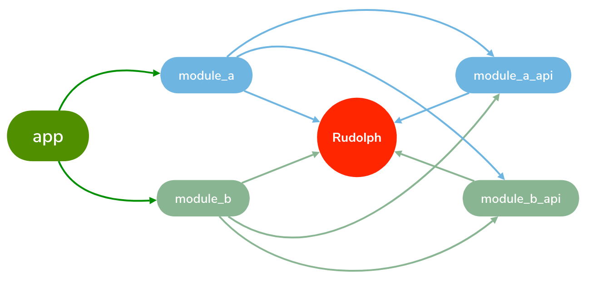

# Rudolph

Rudolph Android Router Framework（鲁道夫安卓路由框架组件）

<p>
   
</p>

### 目录
- [1.框架特性](#1框架特性)
- [2.依赖方式](#2依赖方式)
- [3.代码混淆](#3代码混淆)
- [4.调用方式](#4调用方式)
- [5.注解说明](#5注解说明)
- [6.组件化](#6组件化)
- [7.常见问题](#7常见问题)

### 1.框架特性

- 加载更快，更稳定，无需dex扫描方式加载；
- 无需指定模块名，接入更简单；
- 显式跳转与URL路由地址跳转融为一体，更方便快捷；
- 通过Builder方式传参，无需手动写参数名，从而减少参数传错和修改带来的Bug隐患；
- 支持所有Intent的参数类型；
- 支持Activity 、Fragment、Service、Method四种路由类型
- 支持Instant Run
- 支持AndroidX
- 支持Kotlin

### 2.依赖方式

Build.gradle

``` groovy
repositories {
    jcenter()
    ...
}
```

Java:

``` groovy
dependencies {
  implementation 'cn.wzbos.rudolph:rudolph:1.0.0'
  annotationProcessor 'cn.wzbos.rudolph:rudolph-compiler:1.0.0'
}
```
Kotlin:

``` groovy
apply plugin: 'kotlin-android'
apply plugin: 'kotlin-kapt'

...

dependencies {
  implementation 'cn.wzbos.rudolph:rudolph:1.0.0'
  kapt 'cn.wzbos.rudolph:rudolph-compiler:1.0.0'
}
```
### 3.代码混淆

如果开启了代码混淆，只需要在混淆配置文件中添加如下配置

```
-keep class * implements cn.wzbos.rudolph.IRouteTable{*;}
-keep class * implements cn.wzbos.rudolph.IRouteBinder{*;}
-keepclassmembers class ** {
    @cn.wzbos.rudolph.annotation.Route <methods>;
}
```

### 4.调用方式

- [Activity](#activity)
- [Fragment](#fragment)
- [Service](#service)
- [Method](#method)


#### Activity

定义一个Activity路由，如果不需要用url方式调用可以不写路由地址

``` java
@Route("/activity/test")
public class TestActivity extends AppCompatActivity {
    @Arg("userId")
    int userId;
    
    @Arg("userName")
    String userName;
    
     @Override
     protected void onCreate(Bundle savedInstanceState) { 
        super.onCreate(savedInstanceState);
        Rudolph.bind(this);
     }
            
}
```

调用Activity

``` java
UserActivityRouter.builder().userId(11).userName("John").build().start(context);
```

或者

``` java
Rudolph.builder("/user?userId=11&userName=John").build().open(context);
```

#### Fragment

创建一个Fragment路由

``` java
@Route("/fragment/test")
public class TestFragment extends Fragment {
    @Arg("userId")
    int userId;

    @Arg("userName")
    String userName;
    
    @Nullable
    @Override
    public View onCreateView(LayoutInflater inflater, ViewGroup container, Bundle savedInstanceState) {
        super.onCreate(savedInstanceState);
        Rudolph.bind(this);
    }
}
```

调用Fragment

``` java
Fragment fragment = TestFragmentRouter.builder().userId(11).userName("John").build().open();
```

或者

``` java
Rudolph.builder("/fragment/user?userId=11&userName=John").build().open();
```

#### Service

创建一个服务(适用于跨module调用)

```
@Route(vaule="/service/test",export = true)
public class TestService implements IRouteService{

    @Arg
    int userId;

    @Arg
    String userName;
    
    @Override
    public void init(Bundle bundle) {
        Log.d("TestService", "afterInject");
        rudolph.bind(TestService.this, bundle);
    }

    @Export
    public void showMessage(Context context, String msg) {
        Toast.makeText(context, msg + "\nuserId:" + userId + ",userName:" + userName, Toast.LENGTH_SHORT).show();
    }
}
```

``注意：服务类必须实现IRouteService接口``

调用服务

``` java
ITestService service = TestServiceRouter.builder().userId(1).userName("Tom").build().open();
service.showMessage(MainActivity.this, "Hello Provider!");
```

或者

``` java
ITestService service = (ITestService)Rudolph.builder("/service/test?userId=11&userName=John").build().open();
service.showMessage(MainActivity.this, "Hello Provider!");
```

#### Method

```
public class TestMethod {
    @Route("/method/test")
    public static void Test(@Arg Context context, @Arg int userId, @Arg String userName) {
        Toast.makeText(context, "Hello Method!\nuserId:" + userId + ",userName:" + userName, Toast.LENGTH_SHORT).show();
    }
}

```
调用方式：

``` java
Rudolph.builder("/method/test?userId=11&userName=John").build().open(context);
```

`注意：`
`1.方法必须为静态方法`
`2.context是获取open(context)传的上下文，如果调用的时候没context值则接收的值为ApplicationContext`

### 5.注解说明

- [@Route](#route)
- [@Arg](#arg)
- [@Component](#component)
- [@Export](#export)

#### @Route

此注解为标识一个路由；

- 参数：
	- value：路由地址，可为空，例如@Route("/room")
	- export：是否导出API，一般组件化刚才才会用

``` java
@Route(value = "/user",export = true)
public class UserActivity extends AppCompatActivity {
}
```

#### @Arg

此注解为标识路由的参数（注意如果注解到字段上，此字段不能为private）。

- 参数：
	- value：路由地址，可为空(默认取字段名)，例如@Arg("userId"),@Arg(RAW_URI)
	- base64：标识此参数是否为base64方式编码
	- json：标识此参数是否为json格式

``` java
@Route(value = "/user",export = true)
public class UserActivity extends AppCompatActivity {
	@Arg("userId")
	int userId;
	@Arg
	String userName;
	@Arg(value="userInfo",base64=true, json=true)
	String userInfo;
}
```

#### @Component
此注解为组件化所需要的注解，主要为提供组件初始化操作；

- 参数：无

``` java
@Component
public class TestComponent implements IRouteTable {

    @Override
    public void init(Application application) {
        Toast.makeText(application.getApplicationContext(), "组件xxx初始化啦！", Toast.LENGTH_SHORT).show();
    }
}
```
#### @Export
导出注解的方法，此注解只能用在Method上，且此方法必须为非静态(static)的Public方法；

- 参数：无

``` java
@Route
public class TestService implements IRouteService{

    @Export
    public void showMessage(String message) {
       
    }
}
```

### 6.组件化

场景：`A模块`需要调用`B模块`

实现方式：需要导出`B模块的API`（当然如果想用纯URL的方式调用可以不导出），然后A、B 模块都依赖`B模块的API`

#### 操作步骤：

第一步：在`B模块`的的build.gradle中增加如下配置，其中`export_api_name`为导出的API模块名，`export_api_package`为导出的API包名

``` grovvy
defaultConfig {
    ...
    javaCompileOptions {
                annotationProcessorOptions {
                    arguments = [
                            export_api_name   : project.getName() + "_api",
                            export_api_package: "com.xxxx.module_b_api"
                    ]
                    includeCompileClasspath = true
                }
            }
}
```

第二步：需要在`A模块`和`B模块`中增加依赖

``` groovy
dependencies {
        implementation project(':module_b_api')
}
```

#### 初始化组件

通过以下代码可以初始化每个组件

``` java

@Component
public class TestComponent implements IRouteTable {

    @Override
    public void init(Application application) {
        Toast.makeText(application.getApplicationContext(), "组件xxx初始化啦！", Toast.LENGTH_SHORT).show();
    }
}
```

`（注意：@Component注解的类,每个module中只能存在一个)`

### 7.常见问题

- [路由参数支持哪些数据类型？](#路由参数支持的数据类型)
- [如何初始化组件？](#初始化组件)

#### 路由参数支持的数据类型

``` java
@Route(value = "/activity/test",export = true)
public class TestActivity extends AppCompatActivity {
  @Arg(RAW_URI)
    String routeUri;

    @Arg("stringArg")
    String stringArg;

    @Arg(value = "string64", base64 = true)
    String string64Arg;

    @Arg("stringArray")
    String[] stringArrayArg;


    @Arg("boolArg")
    boolean boolArg;

    @Arg("booleanArray")
    boolean[] booleanArrayArg;

    @Arg("byteArg")
    byte byteArg;

    @Arg("byteArray")
    byte[] byteArrayArg;

    @Arg("shortArg")
    short shortArg;

    @Arg("shortArray")
    short[] shortArrayArg;

    @Arg("intArg")
    int intArg;

    @Arg("intArrayArg")
    int[] intArrayArg;

    @Arg("longArg")
    long longArg;

    @Arg("longArray")
    long[] longArrayArg;

    @Arg("charArg")
    char charArg;

    @Arg("charArray")
    char[] charArrayArg;

    @Arg("floatArg")
    float floatArg;

    @Arg("floatArray")
    float[] floatArrayArg;

    @Arg("doubleArg")
    double doubleArg;

    @Arg("doubleArray")
    double[] doubleArrayArg;

    @Arg("characterArg")
    Character characterArg;

    //ArrayList
    @Arg
    ArrayList<String> stringArrayListArg;

    @Arg
    ArrayList<Integer> integerArrayListArg;

    @Arg(value = "charSequenceArrayList")
    ArrayList<CharSequence> charSequenceArrayListArg;

    @Arg(value = "parcelableArrayList")
    ArrayList<Broker> parcelableArrayListArg;

    @Arg(value = "serialized")
    Broker serializedParam;

    //json
    @Arg(value = "json", json = true)
    User<Broker> jsonParam;

    //encode：json->base64，decode：base64->json
    @Arg(value = "base64json", json = true, base64 = true)
    User<Broker> base64jsonParam;
    
    @Override
    protected void onCreate(Bundle savedInstanceState) {
        super.onCreate(savedInstanceState);
        Rudolph.bind(this);
    }
}
```
