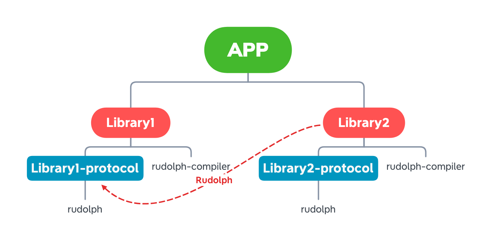

# 使用 Rudolph 进行组件化设计

<p>
   
</p>

> 场景：现有组件 library1 与 library2，library2 需要调用 library1

实现方式：

* 1、创建library1的协议层（library1-protocol）工程
* 2、将library1 需要对外开放的接口与实体类放入协议层（Library1-protocol）
* 3、在library1中建立服务（activity、fragment、method、service）并用@Route注解上
* 4、在library2 组件内依赖 library1的协议层（library1-protocol）
* 5、通过Rudolph调用library1中的路由内容（activity、fragment、method、service）

## 创建组件（实现层）

#### 第一步、在build.gradle中增加如下配置

[@Export](./annotations.md) 可以生成Router类到协议层，并且能根据以下配置自动生成协议层

```groovy
defaultConfig {
    javaCompileOptions {
        annotationProcessorOptions {
            arguments = [
                    //协议层名称
                    export_api_name   : "library1-protocol",
                    //协议层的包名
                    export_api_package: "com.xxxx.library1_protocol"
            ]
            includeCompileClasspath = true
        }
    }
}
```

#### 第三步、添加rudolph依赖

```groovy
dependencies {
    //Rudolph
    implementation "cn.wzbos.android:rudolph:1.x.x"
    annotationProcessor "cn.wzbos.android:rudolph-compiler:1.x.x"
    //依赖协议层
    implementation project(':library1-protocol')
}
```

#### 第四步、组件初始化

> 注意：@Component注解的类,每个module中只能存在一个，***此步骤非必须***

```java

@Component
public class TestComponent implements IRouteTable {

    @Override
    public void init(Application application) {
        Toast.makeText(application.getApplicationContext(), "组件xxx初始化啦！", Toast.LENGTH_SHORT).show();
    }
}
```


